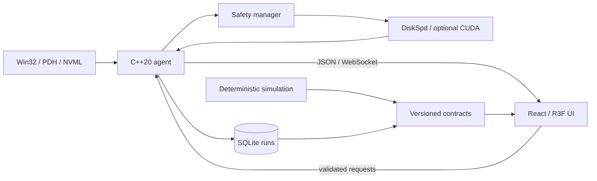

# IOscope for Windows

This is the complete Windows application workspace. Run every command below from
`windows/` (first run `cd windows` from the repository root). Paths in Windows
specifications and historical evidence are relative to this workspace unless stated
otherwise. See the [repository overview](../README.md) for the isolated Linux VM port.

A Windows-first systems performance digital twin and workload laboratory.
**Status: Phases 0-5 verified. Native Workload Lab is implemented; the Phase 6 real-run gate is still outstanding. V1 is not complete.**

Start with [current state](docs/CURRENT-STATE.md), [architecture](docs/02-SYSTEM-ARCHITECTURE.md),
[contracts](contracts/README.md), and [phase plan](docs/19-ROADMAP.md).

The intended loop is Generate → Observe → Understand → Compare → Replay.
LIVE uses hardware measurements; SIMULATED uses explicitly synthetic scenarios;
RECORDED preserves the original live or simulated provenance.
Particles represent aggregated activity, never individual hardware transactions.



## Run and validate simulation

Python 3.13 is the tested documentation/contract tooling runtime:
```powershell
python -m pip install -r tools/requirements.txt
npm ci
npm run verify
npm run simulation:export -- --scenario model-loading --seed 42 --output out/model-loading.json
```
Simulation exports are explicitly synthetic. The generator, contract boundary and recording
fixtures are tested. See [simulation usage](simulation/README.md).
See [tested toolchain](docs/TOOLCHAIN.md) for native build prerequisites.
No DiskSpd installation, CUDA toolkit, third-party models, or API keys are needed for simulation.

## Run the native application

```powershell
./tools/build-agent.ps1 -Configuration Release
npm run build
./build/native-vs16/Release/ioscope_agent.exe .
```

Open http://127.0.0.1:8765. For development, use `npm run dev` at port 5173.
The build creates both the agent and its isolated preparation helper. DiskSpd is a
separate licensed dependency; setup instructions and hashes are documented in
[workload validation](docs/PHASE-5-6-VALIDATION.md).

Live telemetry, the interactive twin, deterministic replay, local run history and
Workload Lab admission controls work. Native execution retains its own recording,
resource watchdog, cancellation and verified scratch cleanup. Unsupported sensors
remain unavailable. No real DiskSpd trial has run. The default trial uses one 64 MiB file and five seconds
of reads after preparation. Disk admission requires 2 GiB spare space plus the file
and a 64 MiB recording allowance (2.125 GiB total), independent of drive capacity.
RAM admission leaves 2 GiB available after the planned helper buffers.

Experiments, Learn, Analyze, optional GPU/Ask features and release packaging remain
unfinished. See the [completion checklist](docs/COMPLETION.md).

## Engineering boundaries

Native Windows 11, C++20, React/TypeScript/Vite/R3F, SQLite, local JSON transport.
Safety validation precedes execution. Missing metrics are Unavailable.
DiskSpd summaries are separate from live system counters. The optional model-like GPU
experiment must measure each supported phase independently; no inference benchmark is promised.

See [research](docs/RESEARCH.md), [asset provenance](docs/15-ASSET-PROVENANCE.md),
[limitations and assumptions](docs/ASSUMPTIONS.md), and [backlog](docs/BACKLOG.md).
Measured UI/telemetry trials and screenshots are documented in the linked validation reports.
Hardware workload results and release packaging await their phase gates.
No distribution license has been selected; no third-party assets are included.
